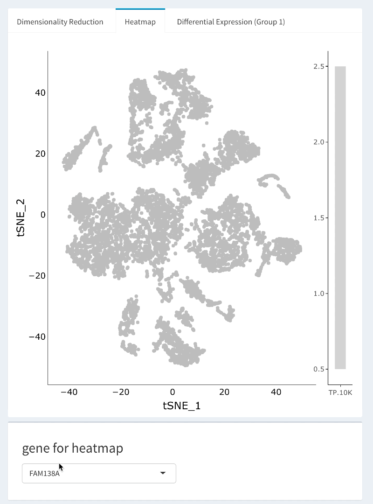

# cellcuratoR
#### Sharing interactive single-cell gene expression visualizations from Seurat


With cellcuratoR, any Seurat-processed (version > 3.0.0) object can easily be converted into a format interpretable by the R-shiny reactive user interface for interactive, exploratory data analysis. This package allows bioinformaticians to interact with and share single-cell RNA sequencing data, facilitating generating violin plots, reclustering subsets of cells, and flexible differential expression analysis. The cellcuratoR package was used to create the freely-accessible Single-Cell Ocular Tissue Analysis (SCOTA) system, which is available at www.oculargeneexpression.org. 

## Installation

``` r
devtools::install_github("drewvoigt10/cellcuratoR")
```

...or...

``` r
source("https://install-github.me/drewvoigt10/cellcuratoR")
```

---

# An overview of the cellcuratoR package

## A. Data pre-processing. 
cellcuratoR converts a Seurat-analyzed single-cell RNA sequencing dataset into a format interpretable by the R Shiny reactive user interface. For users new to Seurat, a guided analysis including basic quality control and clustering is available at: https://satijalab.org/seurat/v3.1/pbmc3k_tutorial.html. We have also included a basic data processing outline as supplemental file 1 (## Task: Update or hyperlink).  

## B. Exporting Seurat-analyzed data to formats interpretable by cellcuratoR
Once an RNA sequencing dataset has undergone quality control and clustering in Seurat, the data can be exported by the the export_seurat_object() function. A detailed vignette of this object is available by (## TASK: how to access vignette?). Briefly, the user should first create a directory (eg my_cellcuratoR_objects) in which to store exported data objects. The export_seurat_object() function requires the following basic arguments:
+ seurat_object: the S4 Seurat object of interest.
+ final_cluster_column_namethe column name (characater string) in the meta.data that corresponds to the final cluster label of each cell. 
+ library_id_column_name: the column name (character string) in the meta.data that corresponds to the originating library of each cell. For canonical-correlation analyzed datasets, this is often the "orig.ident" column within the meta.data. 
+ classification_column_name: the column name (character string) in the meta.data that corresponds to the classified cell type of interest. If cell type classification has not occured, the column name (character string) in the meta.data that corresponds to cluster number should be provided. 
+ export_data_path: a datapath (in the form of a character string) where the Seurat object can be exported (eg my_cellcuratoR_objects/my_dataset1/)

## C. Launching cellcuratoR
The cellcuratoR can be launched simply with the command
```{r}
cellcuratoR::launchApp()
```

## D. Interactive Analysis
Interactive analysis commences by selecting a dataset and exploring visualizations outlined in the following sections. 

### i. Reading in a dataset
To access and interact with the single-cell expression data, the user is prompted to click the "Select Seurat object directory" button and navigate to the directory of the exported Seurat objects (eg my_cellcuratoR_objects). Importantly, the user should NOT navigate to the directory each individual directory (eg my_dataset1). The bottom "content" window previews the contents of the selected directory, and should include a folder for each dataset of interest. 

Next, the user can load a dataset with the "which dataset should be loaded?" dropdown. Upon selection of a dataset, the interactive dimesionality reduction plot in the first tab window will be displayed. Hovering over data points in plot communicates final cluster label, barcode, originating library, and cell type classification. Regions of the plot can be visualized in more detail with the zoom functionality. 


### ii. Heatmaps
Heatmaps in which expression data os overlaid with the dimensionality reduction plot can be accessed via the "Heatmap" tab of the left window. A custom legend provides reference to expression levels as transcripts per 10,000, as the scale.factor used in data normalization is suggested to be 10,000 for compatibility with cellcuratoR.  Like the dimensionality reduction plot, the heatmap is fully interactive with data hovering and zooming. 



### iii. Violin Plots
Violin plots can be used to visualize expression data at the cluster level. Multiple genes can be simultaneously input in the "Violin genes" text box selection. To increase the speed of the user interface, only 50 genes are displayed in the dropdown by default. However, typing the first letters of a gene of interest filters the results and returns only gene names with matching strings to the input. Of note, expression distributions are only drawn if at least 25% of cells in a cluster express the gene of interest. 


### iv. Reclustering
Sometimes, it can be useful to recluster a group of cells for visualization in a lower dimesnional space to look for subclusters or subpopulations. Selected cell populations are renormalized with the LogNormalize method and a scale.factor of 10,000 using the Seurat R package. Variable features are discovered with the vst selection method before scaling and performing dimensionality reduction (principal component analysis (PCA), uniform manifold approximation and projection (UMAP), and t-distributed Stochastic Neighbor Embedding (tSNE)). The reclustered cells can be colored according to originating cluster, originating library, or expression of a gene of interest. 


### v. Differential expression between pre-defined clusters
Differential expression is performed with the Seurat FindMarkers() function with a Wilcoxon Rank Sum test, and can be conducted between groups of preclustered cells. First, the user should select the two differential expression tabs at the top of the dashboard window. This will result in display of the differential expression helper input appearing.  The user may adjust the logFC.threshold, which removes genes with mean expression differences between the two groups that are less than the log-fold change threshold. Additionally the user may adjust the minimum percent threshold, which removes genes that are not expressed in at least the selected proportion of cells in either of the comparison groups. Thresholds with larger values result in faster differential expression testing with less sensitivity, while thresholds with smaller values result in slower differential expression testing with more sensitivity. Next, the user should select what groups will be compared with the differential expression. If the user selects the “predefined clusters” radio button, an additional differential expression helper will be displayed on the right side of the screen where the user can select one or more clusters of cells to be compared. When complete, the user then may click the “Start Differential Expression Analysis” action button, prompting differential expression to start. A progress bar will appear in the lower right corner of the window that displays the progress of the differential expression testing. The differential expression results are displayed both visually and in table format. The average log fold-change (y-axis) and delta.percent (x-axis) of the differentially expressed genes are displayed, where each point depicts the differential expression results of a single gene. The delta.percent variable depicts the percentage of cells in group 1 that express a gene above background minus the percent of cells in group 2 that express the gene above background. This allows for communication of the absolute expression level on the y-axis (logFC) and the proportion of cells expressing each gene on the x-axis (delta.percent). This plot is fully interactive, and the user can hover the mouse over each gene to visualize more information regarding the differential expression analysis. Of note, positive logFC and delta.percent values represent increased expression in clusters selected in Group 1. Cells on the dimensionality reduction plot are colored according to their selected group, with cells in group 1 colored red and cells in group 2 colored blue. Differential expression results are displayed in table format. Genes of interest can be reactively searched in the search bar, and the table can be reordered to display genes enriched in each comparison group by arranging genes based on each column. In addition, results from the differential expression can be exported into .csv or .xlsx files.


### vi. Differential expression between laso selections
In contrast, the user may also manually identify groups for differential expression interactively. If the user selects the “manually select populations (draw lasso)” radio button, an additional, interactive dimensionality reduction plot appears on the right side of the screen. The lasso tool is automatically selected, and the user can draw a lasso around the cell population for Group 1 on the left plot and for Group 2 on the right plot. The user then may select the start differential expression analysis action button.


### vii. Differential expression between different biological conditions
The user may also perform differential expression between other binary identities corresponding to different biologically meaningful features that are identities in the meta.data. These features are identified in the export_seurat_object() function with the optional argument "additional_metadata_cols." For example, in this experiment, foveal and peripheral libraries were independently prepared. By selecting “Perform differential expression between region,” differential expression is performed between foveal and peripheral libraries for all cells selected in the group (in this case, glial cell populations). This feature is also compatible with the lasso selection tool.


## E. Downloading cellrangeR compatioble data objects from SCOTA (www.oculargeneexpression.org)
Task TBD.

## F. Citation
Task TBD. 
